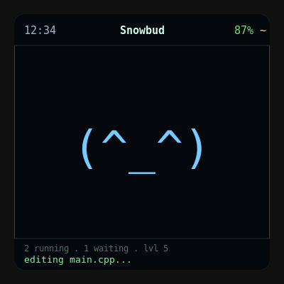
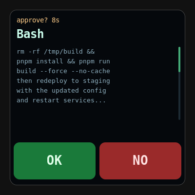

# claude-desktop-buddy

A BLE desk pet for Claude Desktop, running on the [Waveshare ESP32-S3-Touch-LCD-4B](https://www.waveshare.com/esp32-s3-touch-lcd-4b.htm). It connects to the Claude macOS/Windows app over Bluetooth, showing permission prompts, session activity, and an animated pet character on a 480x480 touchscreen.

The pet sleeps when nothing is happening, wakes when sessions start, sweats when Claude is working hard, and alerts you when a permission prompt is waiting. Approve or deny right from the touchscreen.

Forked from [FradSer/claude-desktop-buddy](https://github.com/FradSer/claude-desktop-buddy), which targets the M5StickC Plus. This fork rewrites the hardware layer for the Waveshare 4B's larger touchscreen, audio codec, and battery management.

<p align="center">
  
  
</p>

## Hardware

**Board:** Waveshare ESP32-S3-Touch-LCD-4B

- 480x480 ST7701 RGB parallel display
- GT911 capacitive touchscreen (I2C)
- AXP2101 power management (battery monitoring, charging, power-off)
- ES8311 audio DAC with speaker amplifier
- ESP32-S3 with 16MB flash, 8MB PSRAM
- PH2.0 LiPo battery connector

No other boards are supported by this build. The original M5StickC Plus firmware lives in the upstream repo.

## Flashing

### Prebuilt binary (no build tools needed)

Download `firmware-merged.bin` from the [latest release](https://github.com/greipfrut/claude-desktop-buddy/releases/latest), install [esptool](https://github.com/espressif/esptool) (`pip install esptool`), and flash:

```bash
esptool.py --chip esp32s3 --port COM4 write_flash 0x0 firmware-merged.bin
```

Replace `COM4` with your port (`/dev/ttyUSB0` on Linux, `/dev/cu.usbserial-*` on macOS).

If the device had different firmware before, erase first:

```bash
esptool.py --chip esp32s3 --port COM4 erase_flash
esptool.py --chip esp32s3 --port COM4 write_flash 0x0 firmware-merged.bin
```

### Build from source (PlatformIO)

```bash
git clone https://github.com/greipfrut/claude-desktop-buddy.git
cd claude-desktop-buddy
pio run                                    # build
pio run -t upload --upload-port COM4       # flash firmware
pio run -t uploadfs --upload-port COM4     # flash GIF filesystem (optional)
```

The first build takes 10+ minutes (from-source framework compile with custom sdkconfig for PSRAM and GDMA fixes). Later builds take 1-3 minutes.

## Pairing

1. Enable developer mode in Claude Desktop: **Help > Troubleshooting > Enable Developer Mode**
2. Open **Developer > Open Hardware Buddy**
3. Click **Connect** and pick your device (advertises as `Claude-XXXX`)
4. macOS will prompt for Bluetooth permission on first connect

The bridge auto-reconnects whenever both sides are awake.

## Controls

Everything is touch-based. There are no physical buttons.

| Gesture | Action |
|---|---|
| Tap | Next screen (home > pet > info > home) |
| Tap (on menu row) | Select / confirm |
| Long press | Open or close menu |
| Drag vertically | Scroll the approval hint text |
| Tap OK / NO | Approve or deny a permission prompt |

The screen turns off after 30 seconds of inactivity (stays on while a prompt is waiting or while charging). Any touch wakes it.

## Screens

**Home** - Top bar shows the clock, pet name, and battery percentage. The pet fills the center. Bottom bar shows running/waiting sessions, level, and the latest status message.

**Approval** - When Claude needs permission to run a tool, the screen shows the tool name, the full hint text (scrollable by dragging), and large OK/NO buttons. A timer counts how long the prompt has been waiting.

**Pet** - Stats page (mood, fed, energy, level, approval counts, token usage) and a how-to page. Tap to cycle pages.

**Info** - Six pages: about, touch help, Claude session details, device/battery, Bluetooth status, credits. Tap to cycle.

**Clock** - Appears automatically when idle, connected, and on USB power. Shows the current time synced from the desktop bridge.

**Menu** - Long-press anywhere to open. Settings (brightness, sound, Bluetooth, pet selection, etc.), power off, help, about, demo mode.

## Pets

Eighteen ASCII species, each with seven animations (sleep, idle, busy, attention, celebrate, dizzy, heart). Cycle them in Settings > pet. Your choice persists across reboots.

You can also install a custom GIF character by dragging a character pack folder onto the Hardware Buddy window in Claude Desktop, or by flashing directly:

```bash
python tools/flash_character.py characters/bufo
```

A character pack is a folder containing `manifest.json` and GIF files. See `characters/bufo/` for an example. GIFs are upscaled with nearest-neighbor filtering to fill the 480x480 display.

## The seven states

| State | Trigger | Look |
|---|---|---|
| sleep | Bridge not connected | Eyes closed, slow breathing |
| idle | Connected, nothing urgent | Blinking, looking around |
| busy | Sessions actively running | Sweating, working |
| attention | Approval prompt pending | Alert, urgent |
| celebrate | Level up (every 50K tokens) | Confetti, bouncing |
| dizzy | (reserved for future IMU shake) | Spiral eyes, wobbling |
| heart | Approved a prompt in under 5 seconds | Floating hearts |

## Project layout

```
src/
  main.cpp          - Loop, state machine, all UI screens, gesture decoder
  display.h/cpp     - ST7701 RGB panel driver, canvas setup
  touch.h/cpp       - GT911 capacitive touch driver
  power.h/cpp       - AXP2101 battery/charging reads, power-off
  audio.h/cpp       - ES8311 DAC, async beep synthesis
  es8311.h/c        - ES8311 codec register driver
  compat.h          - Display library shims (TFT_eSPI to Arduino_GFX)
  buddy.h/cpp       - ASCII species dispatch and render helpers
  buddies/          - One file per species (18 total), seven animations each
  character.h/cpp   - GIF decode and render with integer upscaling
  ble_bridge.h/cpp  - Nordic UART Service BLE stack
  data.h            - Wire protocol JSON parser
  stats.h           - NVS-backed persistent stats and settings
  xfer.h            - BLE folder push receiver (GIF character transfer)
  clock.h           - Software RTC (synced from desktop bridge)
characters/         - Example GIF character packs
tools/              - prep_character.py, flash_character.py
platformio.ini      - PlatformIO build config (pioarduino, from-source sdkconfig)
partitions.csv      - Flash partition table
REFERENCE.md        - BLE wire protocol spec (Nordic UART, JSON schemas)
CLAUDE.md           - Project guide and build notes
```

## BLE protocol

The device communicates over the Nordic UART Service. The wire protocol is documented in [REFERENCE.md](REFERENCE.md): UUIDs, JSON schemas, and the folder push transport. Any device that advertises Nordic UART and parses newline-delimited JSON will work with Claude Desktop's Hardware Buddy bridge.

## Credits

Original project by Felix Rieseberg / Anthropic.
Waveshare 4B port by [greipfrut](https://github.com/greipfrut) and Claude.
